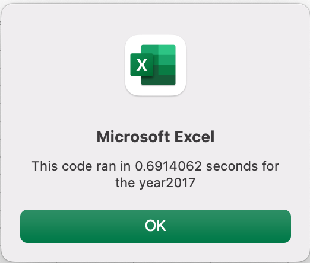

# vba_challenge
## Overview of the Project
Steve's analysis of stocks for the years 2017 and 2018 worked well for the quantity that he currently had on file. However, Steve identified that the code needed to be refined in order for it to be used for mass amounts of data. The request was to take the code that had been created initially through Module 2 and refactor it so that it was more prepared to handle mass amounts of data. If the refactoring was successful, we would see a significant increase in the speed in which the code was able to operate.
## Results of Analysis and VBA Refactoring
The refactoring of the VBA was successful as it was able to cut down on the time it took for the code to look through all data points significantly. The images below are indicative of the times before refactoring where the macro took nearly 1 full second to run. 
### Results of Analysis Before Refactoring 

### Results of Analysis After Refactoring

### Comparison of Code:Before and After Refactoring
Below you will images of the code both before and after refactoring with the first image depicting the before code and the second image depicting the after code. 

## Summary
### Advantages and Disadvantages of Refactoring in General
Refactoring is an important process to understanding when utilizing code that has been written by someone else. Oftentimes there are ways to make a code slightly more responsive and efficient and this is what refactoring is. As mentioned, an advantage of refactoring is that its purpose is to increase the efficiency of the code and allow it to operate optimally. A disadvantage of refactoring is that it requires a complete understanding of what was done in the original code and how that process can be altered. If you are knowledgeable in coding, refactoring should become a common practice. 
### Advantages and Disadvantages of Refactoring for VBA Challenge
A major advantage of refactoring the code for the VBA Challenge is that it cut down the time it took for the command by nearly half a second, which is significant. This half a second indicates that this code would more than likely be able to handle significantly more data. 
A disadvantage of refactoring the code for the VBA Challenge is that you can make an operating macro no longer be functional. One hiccup that I ran into was I had forgotten to add For i = 0 To 11 back into my macro when developing outputs for my arrays. This caused me to run into several overflow errors but I was able to reconcile this error by looking at previous work on modules and other projects. 
